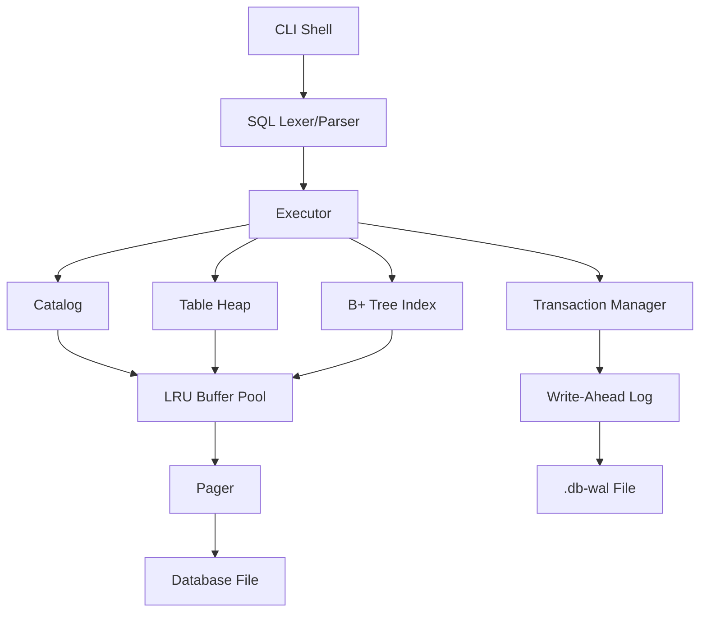

# PyDB

PyDB is a lightweight relational database engine built from scratch in Python. The goal is to expose the core moving parts of a relational database in clean, readable Python.

## Features

- Interactive CLI shell with `pydb> ` prompt
- SQL subset:
  - `CREATE TABLE`
  - `INSERT`
  - `SELECT *`
  - `SELECT * ... WHERE`
  - `DELETE ... WHERE`
  - `CREATE INDEX`
  - `BEGIN`, `COMMIT`, `ROLLBACK`
- Data types:
  - `INT`
  - `TEXT`
- WHERE operators:
  - `=`, `!=`, `<`, `<=`, `>`, `>=`
- Page-based storage with 4096-byte pages
- Persistent catalog stored in database page 0
- Variable-length row serialization
- Slotted heap pages with tombstone deletion
- Persistent integer-key B+ tree indexes
- Automatic indexed lookup for equality predicates
- LRU buffer pool with dirty-page flushing and hit/miss stats
- Logical WAL with transaction rollback and startup recovery
- Pytest test suite and benchmark scripts

## Architecture



## Quick Start

Install in editable mode:

```bash
pip install -e ".[dev]"
```

Start the shell:

```bash
python -m pydb.cli demo.db
```

Example session:

```sql
CREATE TABLE users (id INT, name TEXT, age INT);
INSERT INTO users VALUES (1, 'Kunal', 21);
INSERT INTO users VALUES (2, 'Asha', 25);
SELECT * FROM users;
SELECT * FROM users WHERE age > 21;
CREATE INDEX idx_users_id ON users(id);
SELECT * FROM users WHERE id = 2;
BEGIN;
DELETE FROM users WHERE id = 1;
ROLLBACK;
.tables
.schema users
.exit
```

## Internal Design Summary

PyDB stores the database in fixed-size pages. Page 0 is reserved for catalog metadata. Table rows are encoded using the schema, placed into heap pages, and addressed by row pointers of the form `(page_id, slot_id)`.

`TEXT` values are variable length and stored as:

```text
4-byte length + UTF-8 bytes
```

Heap pages use slots containing:

```text
offset, length, live/deleted flag
```

Indexes map integer keys to row pointers using a persistent B+ tree. Inserts update indexes automatically. Deletes remove index entries and rebalance underfull B+ tree nodes through borrowing, merging, and root shrinking.

The buffer pool caches pages in memory and flushes dirty pages on eviction, transaction commit/rollback, recovery, explicit flush, and close.

The WAL is a logical JSON-lines log for row-level `INSERT` and `DELETE` records. It supports rollback and startup cleanup of uncommitted changes.

## Documentation

- [Architecture](docs/architecture.md)
- [Storage Engine](docs/storage-engine.md)
- [B+ Tree](docs/bplus-tree.md)
- [WAL and Recovery](docs/wal-recovery.md)

## Limitations

- No joins, aggregates, `UPDATE`, `ORDER BY`, or secondary SQL features
- No query optimizer
- B+ tree supports integer keys only
- Merged B+ tree pages are not reused through a free-page list yet
- WAL is logical and simplified, not ARIES
- No MVCC or concurrent transaction isolation
- No overflow pages for very large `TEXT` values
- Catalog currently fits inside one metadata page

## Future Improvements

- Add `UPDATE`
- Add joins and projection lists
- Add cost-based choice between scan and index
- Add free-page reuse for merged B+ tree nodes and deleted heap space
- Add overflow pages for large values
- Add page checksums
- Add concurrent readers with locks
- Add stricter crash-safety tests
